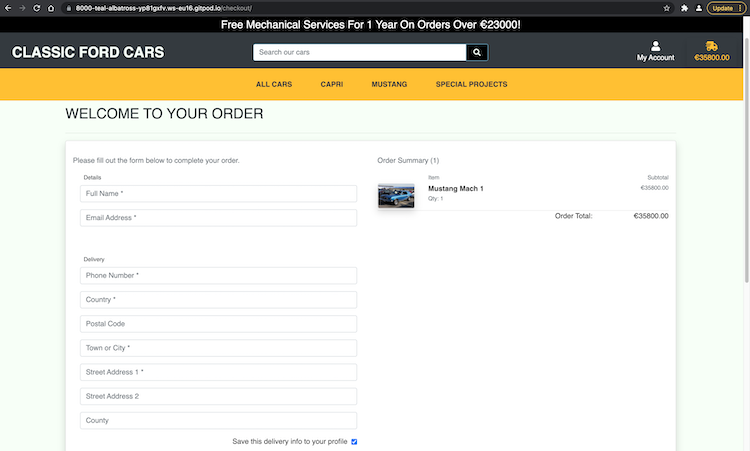

# CLASSIC FORD CARS


https://classic-ford-cars.herokuapp.com/


## About the Project

Classic Ford Cars is a fictitious car dealers website whereby users can view a selection of classic Ford cars, such as Capri, Mustang, GT40 and Ford Rally Cars.

By inputting a Stripe test credit card, users will be able to purchase these cars. I aim to make this website as authentic as possible.

The project will be built utilising, HTML5, CSS3, JavaScript, Python and Django to the best of my capabilities.

All design decisions have been made with the following goals in mind:
- To be accessible to users with disabilities.

- Easy to find your way around.
- Responsiveness design.
- Consistant design.

---

# USER EXPERIENCE

## User Stories

### **As a first-time customer to Classic Ford Cars...**
- As a first time customer, I would like to see what the website is about at a glance.

- As a first time customer, I want to see what the website is selling.
- As a first time customer, I would like to be able to navigate throughout the website easily.
- As a first time customer, I would like to see an ABOUT section, displaying the appropiate information about the website.
- As a first time customer, I would like to see a CONTACT page displaying all necessary contact information, such as a map, email address and phone numbers.

### **Searching For Cars**
- As a first time customer, I would like to see all the cars the website is selling.

- As a first time customer, I would like to be able to search by category.
- As a first time customer, I would like to be able to search the various different models with different search filters.
- As a first time customer, I would like to view the car models according to price.
- As a first time customer, I would like to see how many cars are in a product.


- As a first time customer, if I run a search for something, I expect to see my query ruturned, a count of the products, what I searched with a link back to the main products page.


- As a first time customer, I would like the ability to arrange cars by price from high to low.


- As a first time customer, I would like the ability to arrange cars by price from low to high.


- As a first time customer, I would like the ability to arrange cars by name from a to z.


- As a first time customer, I would like the ability to arrange cars by name from z to a.


- As a first time customer, I would like the ability to arrange cars by rating from high to low.


- As a first time customer, I would like the ability to arrange cars by rating from low to high.


- As a first time customer, I would like the ability to arrange cars by category from a to z.


- As a first time customer, I would like the ability to arrange cars by category from z to a.


### **Browsing / Purchasing**
- As a first time customer, I would like to see the car price.

- As a first time customer, I would like to see a brief description.
- As a first time customer, I would like to be able to add cars to my shopping cart.


- As a first time customer, I would like to be notified on screen when cars are put in the shopping cart or when certain interactions are made.
- As a first time customer, I would like to be able to edit my shopping cart.
- As a first time customer, I would like to know whether there's something in my cart.


- As a first time customer, I would like the checkout process to be easy without having to be taken to any additional pages.
- As a first time customer, I would like confirmation of my order to be emailed to my email address.

### **Customer Profile**
- As a first time customer, I would like to be able to create a profile.

- As a first time customer, I would like to save my email and address to my profile.
- As a first time customer, I would like to see my previous order details.
- As a first time customer, I would like all my previous orders to be easily accessible in my profile.

### **Website Owner / Admin**
- As the website owner / admin, I would like to be able to edit new cars easily.

- As the website owner/admin, I would like to be able to add new cars easily.
- As the website owner/admin, I would like to be able to delete cars easily.
- As the website owner/admin, I would like to have access to the main admin page.
- As the website owner/admin, I would users to be able to navigate throughoutt the site without them getting lost.

---

# WIREFRAMES

Below are some basic wireframes designed for mobile, tablet and desktop created at the initial design phase.

**Homepage**


**Page to show all cars**


**Page to show the car descriptions**


**Page to show the order page**


**Page to show the user's profile**


---

# DATABASE MODELS 

## Category Model

KEY            | TYPE FIELD              | RELATIONSHIP        | BLANK        | NULL      |
-------------- | ----------------------- | ------------------- | ------------ | --------- |
name	       | CharField               | /                   | /            | /         |
friendly_name  | CharField               | /                   | True         |	True      |
sku	           | CharField               | /                   | True	      | True      |


## Products Model

KEY            | TYPE FIELD              | RELATIONSHIP        | BLANK        | NULL      | MAX DIGITS   | DECIMAL PLACES     | MAX LENGTH   |
-------------- | ----------------------- | ------------------- | ------------ | --------- | ------------ | ------------------ | ------------ |
category       | ManyToMany              | Categories          | True         | True      | /            | /                  | /            |
sku            | CharField               | /                   | True         | True      | /            | /                  | 254          |
name           | CharField               | /                   | /            | /         | /            | /                  | 254          |
description    | TextField               | /                   | /            | /         | /            | /                  | /            |
price          | DecimalField            | /                   | /            | /         | 10           | 2                  | /            |
rating         | DecimalField            | /                   | True         | True      | 6            | 2                  | /            |
image_url      | URLField                | /                   | True         | True      | /            | /                  | 1024         |
image          | ImageField              | /                   | True         | True      | /            | /                  | /            |


## Order Model

KEY              | TYPE FIELD              | RELATIONSHIP        | BLANK        | NULL      | MAX DIGITS   | DECIMAL PLACES     | MAX LENGTH   | DEFAULT  |
---------------- | ----------------------- | ------------------- | ------------ | --------- | ------------ | ------------------ | ------------ | ---------|
order_number     | CharField               | Order               | /            | False     | /            | /                  | 32           | /        |
user_profile     | ForeignKey              | /                   | True         | True      | /            | /                  | /            | /        |
full_name        | CharField               | /                   | False        | False     | /            | /                  | 50           | /        |
email            | EmailField              | /                   | False        | False     | /            | /                  | 254          | /        |
phone_number     | CharField               | /                   | False        | False     | /            | /                  | 20           | /        |
country          | CountryField            | /                   | False        | False     | /            | /                  | /            | /        |
postcode         | CharField               | /                   | False        | False     | /            | /                  | 20           | /        |
town_or_city     | CharField               | /                   | False        | False     | /            | /                  | 40           | /        |
street_address1  | CharField               | /                   | False        | False     | /            | /                  | 80           | /        |
street_address2  | CharField               | /                   | True         | True      | /            | /                  | 80           | /        |
county           | CharField               | /                   | True         | True      | /            | /                  | 80           | /        |
date             | DateTimeField           | /                   | /            | /         | /            | /                  | /            | /        |
order_total      | DecimalField            | /                   | /            | False     | 10           | 2                  | /            | 0        |
grand_total      | DecimalField            | /                   | /            | False     | /            | /                  | /            | 0        |
original_cart    | TextField               | /                   | False        | False     | /            | /                  | /            | ''       |
stripe_pid       | CharField               | /                   | False        | False     | /            | /                  | 254          | ''       |


## User Profile Model

KEY                     | TYPE FIELD              | RELATIONSHIP        | BLANK        | NULL      | MAX LENGTH   | 
----------------------- | ----------------------- | ------------------- | ------------ | --------- | ------------ | 
user                    | OneToOneField           | UserProfile         | /            | /         | /            |  
default_phone_number    | CharField               | /                   | True         | True      | 20           |
default_street_address1 | CharField               | /                   | True         | True      | 80           | 
default_street_address2 | CharField               | /                   | True         | True      | 80           | 
default_town_or_city    | CharField               | /                   | True         | True      | 40           |
default_county          | CharField               | /                   | True         | True      | 80           | 
default_postcode        | CharField               | /                   | True         | True      | 20           |
default_country         | CountryField            | /                   | True         | True      | /            |


## Products In Json Format

```
[
    {
        "pk": 1, "model": "products.product", "fields":
        {
            "sku":
            "name":
            "description":
            "price":
            "category":
            "rating":
            "image": ""
        }
    }
]

```

## Categories In Json Format

```
[{
        "pk": 1,
        "model": "products.category",
        "fields": {
            "name": "capri_mark_1",
            "friendly_name": "Capri Mark 1"
        }
    },
    {
        "pk": 2,
        "model": "products.category",
        "fields": {
            "name": "mustang_mach_1",
            "friendly_name": "Mustang Mach 1"
        }
    },
    {
        "pk": 3,
        "model": "products.category",
        "fields": {
            "name": "capri_mark_2",
            "friendly_name": "Capri Mark 2"
        }
    },
    {
        "pk": 4,
        "model": "products.category",
        "fields": {
            "name": "capri_rally_cars",
            "friendly_name": "Capri Rally Cars"
        }
    },
    {
        "pk": 5,
        "model": "products.category",
        "fields": {
            "name": "racing_mustangs",
            "friendly_name": "Racing Mustangs"
        }
    },
    {
        "pk": 6,
        "model": "products.category",
        "fields": {
            "name": "new_arrivals",
            "friendly_name": "New Arrivals"
        }
    }
]

```


---

# DESIGN

## Website Typography
For the Classic Ford Cars logo, I chose Parisienne obtained from Google Fonts. I liked it because it's similiar to the original Ford logo.

### About Parisienne
Parisienne is a casual connecting script inspired by a 1960s Bra advertisement! It has a slight bounce and intentional irregularity to what might other wise appear to be a more formal script font. Classic, yet free spirited, it is a typestyle for a wide variety of use.


For all body and heading text, I'll be using Noto Sans. I decided to use this font because it's a nice clean design and looks well on both Mac and PC displays.

### About Noto Sans
This is the Sans-Serif Latin, Greek and Cyrillic and Devanagari family. It has Regular, Bold, Italic and Bold Italic styles and is hinted. It has a Serif sister family, Noto Serif.

Noto fonts for many other languages are available as web fonts in Google Fonts Early Access.


**Decided against using Parisienne as it just didn't look too great, looked a bit tacky to be honest. Instead, I'll be using Noto Sans throughout the website.**

## Colour Scheme

Below is a colour palette generated from [coolors](https://coolors.co/), which will be used throughout the website. 

- Body background colour will be the off-white #F7FFF7

- Footer and main body text will be the charcoal black #343434

The remainding colours will be used for buttons and navigational links.


## Website Imagery

All images of the Ford cars have been sourced from [Dreamstime](https://www.dreamstime.com).

One large hero image will cover half of the homepage. The main navbar will have a transparency background as to not take away from the main inmagery.

In order to make it look like a genuine car dealers, I think it would look good if below the hero image, I had images of "employees". This feature came as an after thought prior to doing my wireframes.

## Making Images Stand-Out

In order to promote some decent UX for the potential customer, I decided to make the images stand-out by giving the card element a nice subtle shadow. 
With the card being white, this feature looks great against the off-white colour used as the body background colour.


## Category Badges

In order to keep the design of the badges inline with the cards, the same styling has been applied. This is good practice for keeping things consistent with the overall look and feel of the site. The badges gives the user instant feedback of how many categories a car appears in. These badges are also active links that take the user to the approiate page when clicked.


Again, from the user experience's point of view, it's better that the badges have a hover affect on them. this makes it more appealing, and it also informs the user that it is a clickable link.


## Back To Top

It's good UX design to have a Back-To-Top button when dealing with many products. At the time of implementing this feature, I have only 7 cars added so it probably doesn't seem like a worthwhile addition, but I will add more cars at the end! And keeping the design consistant, I've kept the styles the same as the badges. With the hover effect, though, I was unable to change the font awasome icon colour with the hover effect.

Rather than having a Back-To-Top button that just snaps back to the top, I opted to have one with a nice smooth scrolling. I chose this affect because if you have scolled down throughout say maybe 100 different products, your eyes get stuck into a bit of a trance. Having a Back-To-Top button that just snaps up up can leave the user a bit lost as they are jolted out of their trance. A smooth scrolling, guides the user's eye upward, which makes for a better experience for the user, particulary the first time visitor.


## Bootstrap Toast Notifications

Bootstrap Toast Notifications are lightweight notifications designed to mimic the push notifications that have been popularised by mobile and desktop operating systems in recent years. Toasts provide the user with realtime information, in my case their items being added to the cart. The toast has a preview of what they are ordering and a link to the checkout page.

Toasts are great for the user's UX as they can casually browse an e-commerce website, adding items to their cart without having to go to the checkout page to see what's in the cart.


## Checkout Page

The form on the checkout page keeps the consistant design used throughout the website, maintaining the subtle use of Bootstrap cards and shadows.
This form comes with the option to save the order to the user's profile.



The checkout buttons, again maintain the use of cards and shadows. The amount that's about to be charged to their credit card is in a red colour with an exclamation icon, warning the user of what will happen should they proceed.


## Form Fields

As a nice subtle effect for the UX in mind, when a user is filling out a field on the form, a nice drop-down shadow appears to indicate which part of the form they are currently on. This has the addition of some nice transition so that if a user is quickly tabbing their way through the form, the shadow effect just doesn't snap off.


## Payment Spinner

Sometimes when you make a purchase on website, you are left waiting for while to see if your payment is being accepted. When the user is left staring at the screen wondering if their payment is being accepted, they might hit refresh or the back button doing this can affect the payment process. So inorder to give the user some visual queue that something is happening, I added in a loading-spinner screen.


## Django Countries

Rather than the user having to type in a country code when filing out the checkout form, they can select their country from a dropdown list. During testing I was using IR for Ireland, which I couldn't understand why the card was being declined. I should have been using IE, IR is Iran. A common mistake that could infuriate the user. Django Countries will eliminate this error from the user.


---

# WEBSITE FEATURES

- To ensure website nav items are always within reach, a fixed-top class was added to prevent users from going on a scrolling mission to get to the navbar.

- A search bar to search through the various cars.
- Filtering, sorting and searching.
- With the user experience in mind, search entries are case insensitive, which means that 'Capri' and 'capri' will both give the same result. I opted to add this in because that's how users search for anything on Google.
- The ability to sign up and create an account.
- Superuser has the ability to maintain the website, by updating or deleting cars.
- The ability to add cars to the 'bag' and see the cost dynamically update.
- If something is in the 'bag', font will be bold and a diffrent colour to give the user visual feedback.
- Fixtures is used in order to load data very quickly into a django database so we don't have to do it all manually in the admin.
- Simple back to top button.
- Bootstrap Toast Notifications.

## Featured Installed Apps

- django.contrib.admin

- django.contrib.auth
- django.contrib.contenttypes
- django.contrib.sessions
- django.contrib.messages
- django.contrib.staticfiles
- django.contrib.sites
- allauth
- allauth.account
- allauth.socialaccount
- Home
- Products
- Cart
- Checkout
- Profiles

### Other

- Crispy Forms

---

# DEPLOYMENT

The deployment process listed below assumes that you have
1. A GitHub Account
2. A Heroku Account
3. A Stripe Account
4. An Amazon AWS Account 


## Deploying to Heroku
### Create the app
1. Create app and give it a name, then select your region.
2. Add Posrtgres to the app by searching for it from the “Resources” tab
3. From the settings tab, click “Reveal Config Vars” and copy down the whole DATABASE_URL value

    `postgres://…`

4. Install the following in the CLI (terminal) in order to use Postgres

    ```
	pip3 install dj_database_url
    pip3 install psycopg2-binary
	```

5. Freeze the requirements

    `pip3 freeze > requirements.txt`

### Enable the postgres database
1. Import dj_database_url in settings.py

    `import dj_database_url`

2. Comment out the default DATABASES configuration, replace the configuration with a call to dj_database_url.parse(), populating the string with the copied DATABASE_URL variable from above

	```
	# DATABASES = {
	#    'default': {
	#        'ENGINE': 'django.db.backends.sqlite3',
	#        'NAME': BASE_DIR / 'db.sqlite3',
	#    }
	# }

	DATABASES = {
    	'default': dj_database_url.parse('postgres://...')
	}
	```

### Migrating data

1. Run migrations and migrate database to Postgres from the CLI

	```
	python3 manage.py showmigrations
	python3 manage.py migrate
	```

2. Import database data (found in the fixtures folder of the app) via the CLI ensuring to import the dependency before the dependants (eg, categories before products)

	```
	python3 manage.py loaddata categories
	python3 manage.py loaddata products
	```

3. Assign superuser from the CLI, and answer prompts to create superuser name, email account and password

	`python3 manage.py createsuperuser`

4. Uncomment (restore) the default DATABASES configuration and remove the dj_database_url.parse(‘postgres://…') version to ensure the database url does not appear in version control

	```
	DATABASES = {
    	'default': {
        	'ENGINE': 'django.db.backends.sqlite3',
        	'NAME': BASE_DIR / 'db.sqlite3',
    	}
	}
	```

5. Commit all changes in the CLI

	```
	git add .
	git commit -m ‘Heroku and postgres set up, data migrated’
	git push
	```

### Using the environment for the DATABASES dictionary

1. Setting os.environ in app/settings.py to use postgres on the live site and sqlite when in development mode. Ensure that the `postges://...` value is NOT inserted in `dj_database_url.parse()`, but that `os.environ.get('DATABASE_URL'))` is entered as the value

	```
	if 'DATABASE_URL' in os.environ:
    	DATABASES = {
        	'default': dj_database_url.parse(os.environ.get('DATABASE_URL'))
    	}
	else:
    	DATABASES = {
        	'default': {
            	'ENGINE': 'django.db.backends.sqlite3',
            	'NAME': BASE_DIR / 'db.sqlite3',
        	}
    	}
	```
2. Install gunicorn via the CLI to act as webserver

	`pip3 install gunicorn`

3. Freeze requirements

	`pip3 freeze > requirements.txt`

### Create a web dyno to run gunicorn and serve the app

1. At system level, create the Procfile and add the following code to create the web dyno

	`web: gunicorn <app_name>.wsgi:application`

### Log in to heroku through the CLI and disable static file collection

1. Log in to heroku then follow prompts

	`heroku login -i`

2. Disable static collection

	Note that this process will clear images and styling from the finished app. These will be restored in the section 'Storing static files and images' (below)

	`heroku config:set DISABLE_COLLECTSTATIC=1`

	Note that if you have more than one heroku app, you will need to specify which app to disable the collection of static on

	`heroku config:set DISABLE_COLLECTSTATIC=1 app name-of-your-app`

### Allow heroku to host the live site and GitHub to host the development site

1. In settings.py add the app to ALLOWED_HOSTS

	`ALLOWED_HOSTS = ['name-of-your-app.herokuapp.com', 'localhost']`

2. Commit and push changes to GitHub from the CLI

	```
	git add .
	git commit -m ‘Deployment to heroku’
	git push
	```

3. Initialize the heroku git remote

	`heroku git:remote -a classic-ford-cars`

4. Push to heroku

	`git push heroku main`

5. Once the CLI has verified the deployment (`Verifying deploy... done. To https://git.heroku.com/classic-ford-cars.git`), navigate to the app in the browser. The application will now be deployed, with the majority of the styling removed, don't panic at this stage, like what I did. If the application is not working, you can use the command given on the page to check the logs in the terminal.

### Set up automatic deployment

1. Connect to GitHub fropm the "Deploy" tab in the app's heroku.com dashboard

2. Click enable automatic deploys

### Set SECRET KEY variables in heroku and GitPod

1. For each of the above, generate a secret key (for example, [from here](https://miniwebtool.com/django-secret-key-generator/))

2. In the heroku dashboard navigate to the settings tab and add `SECRET_KEY` and its value to the Config Vars

3. In the GitPod settings ["variables" tab](https://gitpod.io/variables), repeat the above using a new value for the key

4. In app/settings.py replace the secret key setting with a call to get the key from the environment and use an empty string as a default

	`SECRET_KEY = os.environ.get('SECRET_KEY', '')`

### Debug settings

1. Set debug to be true

    `DEBUG = os.environ.get('DEBUG')`

### Commit

1. In the CLI, add, commit and push as normal. The commits will be pushed both to GiuHub and heroku

	```
	git add .
	git commit -m ‘Deployment to heroku’
	git push
	```

## Storing static files and images

The app will now be live, but currently shows no styling or images, because `DISABLE_COLLECTSTATIC` is set to `1`. These steps will render the CSS styling and return the images to the live site.

### Create a bucket in Amazon AWS

1. Sign in to your Account [here](https://aws.amazon.com/) as a Root User

2. Search "s3" and then click "Create bucket"

3. Name the bucket to match the heroku app name

4. Select region from dropdown menu

5. Allow all public access by unchecking "Block all public access" and accepting the consequences. This is needed as we want the public to see the product images

6. Click "Create Bucket"

7. Open the bucket by clicking its link

### Bucket Properties

1. From the "Properties" tab, enable static website hosting

2. Input the default values for "Index Document" and "Error document"

3. Click "Save"

### Bucket Permissions

1. Add a Coors configuration to set up the required access between the Heroku app and this s3 bucket and then click "Save"

    ```
    [
      {
          "AllowedHeaders": [
              "Authorization"
          ],
          "AllowedMethods": [
              "GET"
          ],
          "AllowedOrigins": [
              "*"
          ],
          "ExposeHeaders": []
      }
    ]
    ```

2. Select “Policy generator” from the Bucket Policy section to create a security policy for the bucket. A new browser window will open

3. From the new browser window,  select "s3 Bucket Policy" in Step 1

4. Allow all Principals by adding an asterisk (`*`) to the Pricipal input area of Step 2

5. Choose "GetObject" from the Actions dropdown menu

6. From the OTHER browser window, copy the Bucket ARN and paste this into the "Amazon Resource Name (ARN)" box of the new window

7. Click "Add Statement" then in Step 3, click "Generate Policy"

8. Copy the Policy JSON Document into the Bucket Policy of the first window

9. Allow access to all resources in the bucket by adding a slash and an asterisk (`/*`) to the end of the Resource key

	`"Resource": "arn:(etc)/*",`

10. Click "Save Changes"

11. Set the Access control list object's permission for Everyone under the Public Access section

12. Accept that you acknowledge the effects

13. Click "Save Changes"

## Identity and Access Management

### Creating AWS Groups Policies and Users in order to access the images and static files

1. From the "Services" dropdown of [aws.amazon.com](aws.amazon.com), search and select "IAM"

### Creating the User Group

1. Select "User Groups" from the dashboard

2. Click "Create group" and name the group. User groups manage permissions, so name the User Group accordingly (for example, `manage-name-of-your-app`)

3. Click "Save changes"

### Creating the Policy

1. Select "Policies" from the dashboard

2. Click "Create polocy" 

3. Click the "JSON" tab, then click "Import managed policy"

4. Search "s3" then select "AmazonS3FullAccess"

5. Click "Import"

6. Since access is only required for this bucket, change the JSON `"Resource": ` key from an asterisk to the below by copying the Bucket ARN (see Bucket Permissions, above) and pasting it into the JSON

	```
	"Resource": [
                "arn:(etc)",
                "arn:(etc)/*"
                ]
	```
7. Click "Next" and add tags if desired

8. Click next to review and name the policy

	`name-of-you-app-policy`

9. Give the policy a description

	`Access to S3 bucket for name-of-your-app static files`

10. Click "Create policy"

### Attaching the Policy to the User Group

1. Select User Groups from the dashboard

2. Select the relevant group name

3. In the "Permissions" tab, click "Add permissions" and then choose "Attach policy" from the menu

4. Select the required policy then click "Add policy"

### Creating the User for the User Group

1. Select "Users" from the dashboard

2. Click "Add users" and add a user name, for example `name-of-you-app-staticfiles-user`

3. Select "Programmatic access" as the AWS access type

4. Click "Next: Permissions"

5. Select the relevant group to add the user to

6. Click "Next: Tags" then add tags if desired

7. Click "Next: Review"

8. Click "Create user"

9. Click "Download .csv" to download the attached csv file. 

	<span style="color:red">**It is very important to download and save this file as it cannot be re-downloaded at a later time!**</span>

## Configure Django to connect to S3

1. In the CLI of the app, install `boto-3` and `django-storages`

	```
	pip3 install boto3
	pip3 install django-storages
	```
2. Freeze the requirements

	`pip3 freeze > requirements.txt`

3. Add `storages` to the list of `INSTALLED_APPS` in app/settings.py

### Add settings to settings.py so that the live site connects to S3

Since the styling and images are available within the app (thanks to the use of the inbuilt sqlite database), they will always be visible while in development. Thus, it is ONLY the live deployed site that needs to connect to S3

1. Add relevant `if` statement: "if there is a vairable called USE_AWS in the environment, then connect to AWS"

	```
	if 'USE_AWS' in os.environ:
    	# Bucket config
    	AWS_STORAGE_BUCKET_NAME = 'name-of-your-app'
    	AWS_S3_REGION_NAME = '(the region choen when setting up AWS)'
    	AWS_ACCESS_KEY_ID = os.environ.get('AWS_ACCESS_KEY_ID')
    	AWS_SECRET_ACCESS_KEY = os.environ.get('AWS_SECRET_ACCESS_KEY')
	```

	<span style="color:red">**Again, it is very important you keep these last two keys' values secret as if they end up in version control someone could use them to store or move data through your S3 bucket and Amazon would bill your credit card for it**</span>

### Adding the AWS keys to heroku's Config Vars

1. In the heroku.com dashboard create two new variables and populate them with the relevant values from the downloaded .csv file

	`AWS_ACCESS_KEY_ID` = Access key ID value

	`AWS_SECRET_ACCESS_KEY` = Secret access key value

2. Add `USE_AWS` to the Config Vars in heroku and set its value to `True`

3. Remove the `DISABLE_COLLECTSTATIC` variable so that when deploying to Heroku, Django will collect static files automatically and upload them to S3

### Tell django where static files will come from in production

1. In app/settings.py, add another vairable to the `if 'USE_AWS' in os.environ:` statement

	`AWS_S3_CUSTOM_DOMAIN = f'{AWS_STORAGE_BUCKET_NAME}.s3.amazonaws.com'`

2. At system level, create a new file called `custom_storages.py`

3. In this file, import the following

	```
	from django.conf import settings
	from storages.backends.s3boto3 import S3Boto3Storage
	```

4. Create the following custom Classes:

	```
	class StaticStorage(S3Boto3Storage):
    	location = settings.STATICFILES_LOCATION

	class MediaStorage(S3Boto3Storage):
    	location = settings.MEDIAFILES_LOCATION
	```

5. Tell app/settings.py that for static file storage it should use the above custom storage Classes and that the location it should save static files to is in a folder called static. Inside the same `if USE_AWS in os.environ:` statement, add

	```
	STATICFILES_STORAGE = 'custom_storages.StaticStorage'
    STATICFILES_LOCATION = 'static'
    DEFAULT_FILE_STORAGE = 'custom_storages.MediaStorage'
    MEDIAFILES_LOCATION = 'media'
	```

6. In the same `if` statement, override and explicitly set the URLs for static and media files using the custom domain and the new locations

	```
	STATIC_URL = f'https://{AWS_S3_CUSTOM_DOMAIN}/{STATICFILES_LOCATION}/'
    MEDIA_URL = f'https://{AWS_S3_CUSTOM_DOMAIN}/{MEDIAFILES_LOCATION}/'
	```

## Caching, Media Files & Admin

### Caching

If the media images and static files are unlikely to change often, they can be cached. Within the same `if` statement, add a cache control dictionary such as

```
if 'USE_AWS' in os.environ:
    # Cache control
    AWS_S3_OBJECT_PARAMETERS = {
        'Expires': 'Thu, 31 Dec 2099 20:00:00 GMT',
        'CacheControl': 'max-age=94608000',
    }

    # Bucket config (added above)
```

### Adding Media Files to S3

1. Back in the aws.amazon.com site, create a new file in the relevant bucket called `media`

2. Clik the file to open it, and then click "Upload", "Add files", and select all the images to be uploaded to AWS

3. Under "Permissions", choose "Grant public read access" and acknowledge the risk

4. Click "Upload"

5. The live site should now render correctly, with styling and images displaying

### Confirm admin status

1. Log in to the live site using the superuser log in details from above and then navigate to `classic-ford-cars-app.herokuapp.com/admin`

2. In "Email addresses" confirm yourself as both Verified and Primary

3. Click "Save"

## Stripe

### Stripe keys

1. Go to your stripe.com account dashboard and navigate to "API keys"

2. Add the "publishable key" and "Secret key" as variables in the Config Vars of your heroku dashboard

	`STRIPE_PUBLIC_KEY` = Publishable key
	
	`STRIPE_SECRET_KEY` = Secret key

### Webhooks

1. Add new webhook endpoints by going to "Webhooks" in the Stripe dashboard and clicking "Add endpoint"

2. Copy the url of the home page of the live site and add this to the webhook Endpoint URL box

3. Add `checkout/wh/` to the end of the entered url

4. Reveal the webhook signing secret and add this to a further variable in Config Vars of the heroku dashboard

	`STRIPE_WH_SECRET` = Signing secret

5. Test by sending a test webhook and checking the logged Response

## Testing

The site should now be live and runnig  perfectly. Test it by creating an order, checking the Events and Webhooks tabs in Stripe, and then by navigating to the admin of the site.

## Emails

For users to create accounts and use the site, they will need to receive emails. 

### The email account

1. Either set up an email account or use an existing account for the site. The easiest way to do this is in gmail.com

2. Allow 2-step verification in gmail

3. Go to "app passwords" and set a site specific password for the django app

	`App`: set "email"
	
	`Device type`: set "django" (for example)

4. Copy the 16 digit password and add this to the heroku dashboard Config Vars

	`EMAIL_HOST_PASS` = the 16 digit passwird

5. Set the email address in Config Vars

	`EMAIL_HOST_USER` = the email account name (name@gmail.com...)

### The live site

1. Certain variables need to be set in app/settings.py. These are

	```
	if 'DEVELOPMENT' in os.environ:
    	EMAIL_BACKEND = 'django.core.mail.backends.console.EmailBackend'
    	DEFAULT_FROM_EMAIL = '<emailaddresschosen@email.com>'
	else:
    	EMAIL_BACKEND = 'django.core.mail.backends.smtp.EmailBackend'
    	EMAIL_USE_TLS = True
    	EMAIL_PORT = 587
    	EMAIL_HOST = 'smtp.gmail.com'
    	EMAIL_HOST_USER = os.environ.get('EMAIL_HOST_USER')
    	EMAIL_HOST_PASSWORD = os.environ.get('EMAIL_HOST_PASS')
    	DEFAULT_FROM_EMAIL = os.environ.get('EMAIL_HOST_USER')
	```

2. Navigate to the live site's admin and go to "Sites"

3. Set the "Domain name" and "Display name" as approrpiate

4. Commit all changes

	```
	git add .
	git commit -m ‘Email set up’
	git push
	```

5. Test by creating a new account and verifiying email reception. Click the verification link in the email to verify the account and then log in

# Cloning 

This repository can be cloned by following these steps:

1. Log in to GitHub and locate the repository.

2. Click the "Code" button:


Either click "Open with GitHub Desktop" and follow the prompts in the GitHub Desktop application, or alternatively follow the instructions from this link, depending on your Operating System.

3. Install the dependencies using these commands:

	```
	# Project dependencies
	pip3 install django
	pip3 install django-allauth==0.41.0
	pip3 install pillow
	pip3 install django-crispy-forms
	pip3 install django-countries
	pip3 install stripe
    pip3 install django-ckeditor
	
	# Deployment
	pip3 install boto3
	pip3 install django-storages
	pip3 install gunicorn
	pip3 install dj_database_url
	pip3 install psycopg2-binary

	# Freeze dependencies to keep them available when publishing
	pip3 freeze > requirements.txt
	```

---

# TESTING

Full details on the relevant testing can be found here: [Testing](TESTING.md)

---

# TECHNOLOGIES USED

## Languages

- [CSS 3](https://developer.mozilla.org/en-US/docs/Web/CSS)

- [HTML 5](https://developer.mozilla.org/en-US/docs/Web/HTML)
- [Javascript](https://developer.mozilla.org/en-US/docs/Web/JavaScript)
- [Python 3.8](https://www.python.org/)

## Frameworks

- [Django 3.1](https://www.djangoproject.com/)

- [jQuery 3.6](https://jquery.com/)
- [Bootsrap 5.0](https://getbootstrap.com/)

## Project management

- [Balsamiq](https://balsamiq.com/wireframes/)

- [GitHub](https://github.com/)
- [GitPod](https://gitpod.io/)
- [Heroku](https://www.heroku.com/about)
- [Stripe](https://stripe.com/en-ie)

## Tools

- [Techsini](http://techsini.com/multi-mockup/index.php)

- [Coolers.co](https://coolors.co/)
- [Favicon.io](https://favicon.io//)
- [Font Awesome](https://fontawesome.com/)
- [Google Fonts](https://fonts.google.com/)
- Preview on Mac to resize images

---

# CREDITS

Credit info goes here

---

# ACKNOWLEDGEMENTS

Acknowledgement info goes here

---
