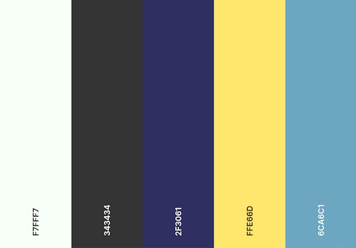

# CLASSIC FORD CARS

Mock up image goes here
With live link

## About the Project

Classic Ford Cars is a fictitious car dealers website whereby users can view a selection of classic Ford cars, such as Capri, Mustang, GT40 and Ford Rally Cars.

By inputting a Stripe test credit card, users will be able to purchase these cars. I aim to make this website as authentic as possible.

The project will be built utilising, HTML5, CSS3, JavaScript, Python and Django to the best of my capabilities.

All design decisions have been made with the following goals in mind:
- To be accessible to users with disabilities.

- Easy to find your way around.
- Responsiveness design.
- Consistant design.

---

# USER EXPERIENCE

## User Stories

### **As a first-time customer to Classic Ford Cars...**
- As a first time customer, I would like to see what the website is about at a glance.

- As a first time customer, I want to see what the website is selling.
- As a first time customer, I would like to be able to navigate throughout the website easily.
- As a first time customer, I would like to see an ABOUT section, displaying the appropiate information about the website.
- As a first time customer, I would like to see a CONTACT page displaying all necessary contact information, such as a map, email address and phone numbers.

### **Searching For Cars**
- As a first time customer, I would like to see all the cars the website is selling.

- As a first time customer, I would like to be able to search by category.
- As a first time customer, I would like to be able to search the various different models with different search filters.
- As a first time customer, I would like to view the car models according to price.

### **Browsing**
- As a first time customer, I would like to see the car price.

- As a first time customer, I would like to see a brief description.
- As a first time customer, I would like to be able to add cars to my shopping cart.
- As a first time customer, I would like to be notified on screen when cars are put in the shopping cart or when certain interactions are made.
- As a first time customer, I would like to be able to edit my shopping cart.
- As a first time customer, I would like the checkout process to be easy without having to be taken to any additional pages.
- As a first time customer, I would like confirmation of my order to be emailed to my email address.

### **Customer Profile**
- As a first time customer, I would like to be able to create a profile.

- As a first time customer, I would like to save my email and address to my profile.
- As a first time customer, I would like to see my previous order details.
- As a first time customer, I would like all my previous orders to be easily accessible in my profile.

### **Website Owner / Admin**
- As the website owner / admin, I would like to be able to edit new cars easily.

- As the website owner/admin, I would like to be able to add new cars easily.
- As the website owner/admin, I would like to be able to delete cars easily.
- As the website owner/admin, I would like to have access to the main admin page.
- As the website owner/admin, I would users to be able to navigate throughoutt the site without them getting lost.

---

# WIREFRAMES

Below are some basic wireframes designed for mobile, tablet and desktop created at the initial design phase.

**Homepage**

**Page to show all cars**

**Page to show the car descriptions**

**Page to show the order page**

**Page to show the user's profile**

---

# DATABASE AND MODEL 

Database and model info goes here

---

# DESIGN

## Website Typography
For the Classic Ford Cars logo, I chose Parisienne obtained from Google Fonts. I liked it because it's similiar to the original Ford logo.

### About Parisienne
Parisienne is a casual connecting script inspired by a 1960s Bra advertisement! It has a slight bounce and intentional irregularity to what might other wise appear to be a more formal script font. Classic, yet free spirited, it is a typestyle for a wide variety of use.

For all body and heading text, I'll be using Noto Sans. I decided to use this font because it's a nice clean design and looks well on both Mac and PC displays.

### About Noto Sans
This is the Sans-Serif Latin, Greek and Cyrillic and Devanagari family. It has Regular, Bold, Italic and Bold Italic styles and is hinted. It has a Serif sister family, Noto Serif.

Noto fonts for many other languages are available as web fonts in Google Fonts Early Access.

**Decided against using Parisienne as it just didn't look too great, looked a bit tacky to be honest. Instead, I'll be using Noto Sans throughout the website.**

## Colour Scheme

Below is a colour palette generated from [coolors](https://coolors.co/), which will be used throughout the website. 

- Body background colour will be the off-white #F7FFF7

- Footer and main body text will be the charcoal black #343434

The remainding colours will be used for buttons and navigational links.

## Website Imagery

All images of the Ford cars have been sourced from [Dreamstime](https://www.dreamstime.com).

One large hero image will cover half of the homepage. The main navbar will have a transparency background as to not take away from the main inmagery.

In order to make it look like a genuine car dealers, I think it would look good if below the hero image, I had images of "employees". This feature came as an after thought prior to doing my wireframes.

## Making Images Stand-Out

In order to promote some decent UX for the potential customer, I decided to make the images stand-out by giving the card element a nice subtle shadow. 
With the card being white, this feature looks great against the off-white colour used as the body background colour.

## Category Badges

In order to keep the design of the badges inline with the cards, the same styling has been applied. This is good practice for keeping things consistent with the overall look and feel of the site. The badges gives the user instant feedback of how many categories a car appears in. These badges are also active links that take the user to the approiate page when clicked.

Again, from the user experience's point of view, it's better that the badges have a hover affect on them. Not that this makes it more appealing, but it also informs the user that it is a clickable link.

---

# WEBSITE FEATURES

- To ensure website nav items are always within reach, a fixed-top class was added to prevent users from going on a scrolling mission to get to the navbar.

- A search bar to search through the various cars.
- Filtering, sorting and searching.
- With the user experience in mind, search entries are case insensitive, which means that 'Capri' and 'capri' will both give the same result. I opted to add this in because that's how users search for anything on Google.
- The ability to sign up and create an account.
- Superuser has the ability to maintain the website, by updating or deleting cars.
- The ability to add cars to the 'bag' and see the cost dynamically update.
- If something is in the 'bag', font will be bold and a diffrent colour to give the user visual feedback.
- Fixtures is used in order to load data very quickly into a django database so we don't have to do it all manually in the admin.

## Featured Installed Apps

- django.contrib.admin

- django.contrib.auth
- django.contrib.contenttypes
- django.contrib.sessions
- django.contrib.messages
- django.contrib.staticfiles
- django.contrib.sites
- allauth
- allauth.account
- allauth.socialaccount
- home
- cars

---

# DEPLOYMENT

Deployment info goes here

---

# TESTING

Full details on the relevant testing can be found here: [Testing](TESTING.md)

---

# TECHNOLOGIES USED

## Languages

- [CSS 3](https://developer.mozilla.org/en-US/docs/Web/CSS)

- [HTML 5](https://developer.mozilla.org/en-US/docs/Web/HTML)
- [Javascript](https://developer.mozilla.org/en-US/docs/Web/JavaScript)
- [Python 3.8](https://www.python.org/)

## Frameworks

- [Django 3.1](https://www.djangoproject.com/)

- [jQuery 3.6](https://jquery.com/)
- [Bootsrap 5.0](https://getbootstrap.com/)

## Project management

- [Balsamiq](https://balsamiq.com/wireframes/)

- [GitHub](https://github.com/)
- [GitPod](https://gitpod.io/)
- [Heroku](https://www.heroku.com/about)
- [Stripe](https://stripe.com/en-ie)

## Tools

- [Techsini](http://techsini.com/multi-mockup/index.php)

- [Coolers.co](https://coolors.co/)
- [Favicon.io](https://favicon.io//)
- [Font Awesome](https://fontawesome.com/)
- [Google Fonts](https://fonts.google.com/)
- Preview on Mac to resize images

---

# CREDITS

Credit info goes here

---

# ACKNOWLEDGEMENTS

Acknowledgement info goes here

---
