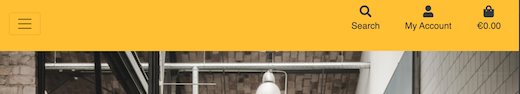

# TESTING USER STORIES

Testing user stories goes here

---

# DJANGO TESTING

## Django Unit Testing

TEST            | OUTCOME                          | PASS / FAIL  
--------------- | -------------------------------- | ---------------
Ensure basic Django Allauth form is working as intended | Basic Django Allauth form is working as intended. Images confirming the outcome of this test. [Allauth test 1](wireframes/allauth_test2.png) - [Allauth test 2](wireframes/allauth_test.png) | PASS
Ensure Django authenticates emails | Django authenticates emails. Image confirming the outcome of this test. [Allauth test 3](wireframes/allauth_test3.png) | PASS
Ensure login system redirects back to the login redirect url in settings | Login system redirects back to the login redirect url in settings. The 'success' url was created to test this. [Allauth test 4](wireframes/allauth_test4.png) | PASS
Ensure the appropiate categories are loaded with the correct fixtures | The appropiate categories are loaded with the correct fixtures. [Load data categories](wireframes/loaddata_categories.png)
Ensure the appropiate products are loaded with the correct fixtures | The appropiate products are loaded with the correct fixtures. [Load data products](wireframes/loaddata_products.png)

---

# MANUAL TESTING

## Front End Testing

TEST            | OUTCOME                          | PASS / FAIL  
--------------- | -------------------------------- | ---------------
Ensure Bootstrap is connected and returning the correct url | Bootstrap is connected and returning the correct url. Image confirming the outcome of this test. [Bootstrap test](wireframes/bootstrap_test.png) | PASS
Ensure basic search functionality works as intended | When a search query is submitted, the result is returned to the address bar. Image confirming the outcome of this test. [Search test](wireframes/searchtest.png) | PASS
Ensure when the My Account is clicked a dropdown menu shows Register and Login | When the My Account is clicked a dropdown menu shows Register and Login. Image confirming the outcome of this test. [Menu test](wireframes/menutest.png) | PASS
Ensure footer social network links work and open up in a new browser tab | Footer social network links work and open up in a new browser tab | PASS
 

---

# DETAILED TESTING

TEST            | OUTCOME                          | PASS / FAIL  
--------------- | -------------------------------- | ---------------

# CHROME LIGHTHOUSE REPORT

---

# RESPONSIVENESS TESTING

## Navbar Responsiveness

Ensure Navbar displays as intended across devices and laptops.

- Navbar displays as intended on laptop and larger screens.

- Navbar displays as intended on smaller screens.

- Navbar displays as intended on mobile screens.

## Footer Responsiveness

Ensure Footer displays as intended across devices and laptops.

- Footer displays as intended on laptop and larger screens.

- Footer displays as intended on smaller screens.

- Footer displays as intended on mobile screens.

---

# BUGS AND ISSUES