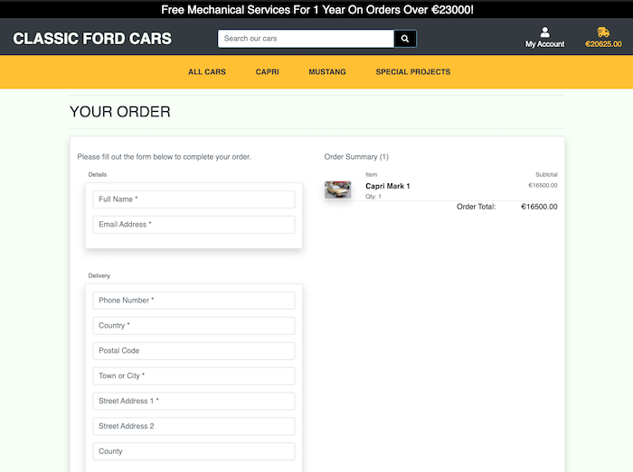
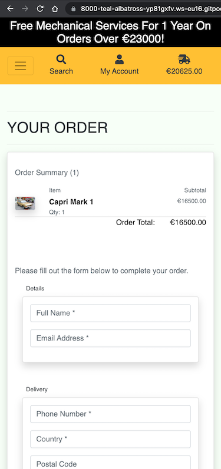
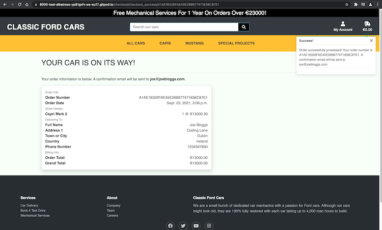

# TESTING USER STORIES

Testing user stories goes here

---

# DJANGO TESTING

## Django Unit and Template Testing

TEST            | OUTCOME                          | PASS / FAIL  
--------------- | -------------------------------- | ---------------
Ensure basic Django Allauth form is working as intended | Basic Django Allauth form is working as intended. Images confirming the outcome of this test. [Allauth test 1](wireframes/allauth_test2.png) - [Allauth test 2](wireframes/allauth_test.png) | PASS
Ensure Django authenticates emails | Django authenticates emails. Image confirming the outcome of this test. [Allauth test 3](wireframes/allauth_test3.png) | PASS
Ensure login system redirects back to the login redirect url in settings | Login system redirects back to the login redirect url in settings. The 'success' url was created to test this. [Allauth test 4](wireframes/allauth_test4.png) | PASS
Ensure the appropiate categories are loaded with the correct fixtures | The appropiate categories are loaded with the correct fixtures. [Load data categories](wireframes/loaddata_categories.png) | PASS
Ensure the appropiate products are loaded with the correct fixtures | The appropiate products are loaded with the correct fixtures. [Load data products](wireframes/loaddata_products.png) | PASS
Ensure in Django Admin 'Categorys' is changed to 'Categories' and the friendly name is diaplayed | in Django Admin 'Categorys' is changed to 'Categories' and the friendly name is diaplayed. [Friendly name](wireframes/friendly_name.png) | PASS
Ensure all car models are displaying on the page with the correct url | All car models are displaying on the page with the correct url. [All products test](wireframes/all_products.png) | PASS
Ensure the cart page renders correctly. | The cart page renders correctly when the users clicks or taps on delivery truck. [Cart page render](wireframes/cart_page.png) | PASS
Ensure that if no items are in the cart, text is displayed telling the user. | If no items are in the cart, text is displayed telling the user. [Empty cart](wireframes/empty_cart.png) | PASS
Enusre the Free Mechanical Services threshold is consistently displayed on every page throughout the site. | The Free Mechanical Services threshold is consistently displayed on every page throughout the site. | PASS
Ensure items are added to the cart and are displaying in the terminal. | Items are added to the cart and are displaying in the terminal. [Add to cart test](wireframes/cart_test_1.png) | PASS
Ensure items are visible in the cart with the correct price attached. | Items are visible in the cart with the correct price attached. [Add to cart test](wireframes/cart_test.png) | PASS
Ensure items are added to the cart displaying, images and prices accordingly. | Items are added to the cart displaying, images and prices accordingly. [Cart items test](wireframes/cart_items.png) | PASS
Ensure items in the cart add up to the correct amount, are displayed to the user in the cart and in the menu. | Items in the cart add up to the correct amount, are displayed to the user in the cart and in the menu. [Cart items test](wireframes/cart_items.png) | PASS
Ensure users are able to delete cars from the cart. | Users are able to delete cars from the cart. When a user clicks on the Remove Car button, car is removed, the total is amended and the page reloads. | PASS
Ensure the appropiate toast message is displayed when a user adds a car to the cart. | The appropiate toast message is displayed when a user adds a car to the cart. [Toast message success 1](wireframes/car_added_success.png) | PASS
Ensure the appropiate toast message is displayed when a user removes a car from the cart. | The appropiate toast message is displayed when a user removes a car from the cart. [Toast message success 2](wireframes/car_removed_toast.png) | PASS
Ensure the product image is displayed within the toast notifications. | The product image is displayed within the toast notifications. [toast image](wireframes/toast_nods.png) | PASS
Ensure the total cost is displayed within the toast notifications. | The total cost is displayed within the toast notifications. [toast image](wireframes/toast_nods.png) | PASS
Ensure the CHECKOUT button takes the user to the checkout page. | The CHECKOUT button takes the user to the checkout page. | PASS
Ensure the appropiate fields are added to the admin checkout. | The appropiate fields are added to the admin checkout. [Admin checkout](wireframes/admin_checkout.png) | PASS
Ensure cripsy forms renders the correct fields. | Crispy forms renders the correct form fiels on the checkout page. Fields marked with an asterisk are required, preventing the form from being submitted unless these fields are filled out. | PASS
Ensure on the checkout page a preview of what the user is buying, an image of the product, its cost and quantity. | On the checkout page a preview of what the user is buying, an image of the product, its cost and quantity. | PASS
Ensure Django-Countries displays a dropdown list of countries. | Django-Countries displays a dropdown list of countries. | PASS
Ensure Full Name contains an * and is required. Unless this field is entered the form is not submitted. | Full Name contains an * and is required. Unless this field is entered the form is not submitted. | PASS
Ensure Email contains an * and is required. Unless this field is entered the form is not submitted. | Email contains an * and is required. Unless this field is entered the form is not submitted. | PASS
Ensure Street Address1 contains an * and is required. Unless this field is entered the form is not submitted. | Street Address1 contains an * and is required. Unless this field is entered the form is not submitted. | PASS
Ensure Phone Number contains an * and is required. Unless this field is entered the form is not submitted. | Phone Number contains an * and is required. Unless this field is entered the form is not submitted. | PASS
Ensure Town Or City contains an * and is required. Unless this field is entered the form is not submitted. | Town Or City contains an * and is required. Unless this field is entered the form is not submitted. | PASS
Ensure Country contains an * and is required. Unless this field is entered the form is not submitted. | Country contains an * and is required. Unless this field is entered the form is not submitted. | PASS


---


## Searching and Filtering

TEST            | OUTCOME                          | PASS / FAIL  
--------------- | -------------------------------- | ---------------
Ensure searching for a particular car name, gives the user the correct response. | Searching for a particular car name, gives the user the correct response. [Search result](wireframes/search_result1.png) | PASS
Ensure if a user searches for example 'blue', the search result not only returns the name but also the description. | If a user searches for example 'blue', the search result not only returns the name but also the description. [Search result](wireframes/search_result2.png) | PASS
Ensure that searches are user friendly by making queries case insensitive. | Searches are user friendly by making queries case insensitive. ```queries = Q(name__icontains=query) Q(description__icontains=query)``` | PASS
Ensure the appropiate filtering is applied when user is using the main navigational links. | The appropiate filtering is applied when user is using the main navigational links. [Filter result 1](wireframes/filter_sample1.png) - [Filter result 2](wireframes/filter_sample2.png) - [Filter result 3](wireframes/filter_sample3.png) - [Filter result 4](wireframes/filter_sample4.png) | PASS
Ensure cars are sorted By Price ascending | Cars are sorted by Price ascending ``` ?sort=price&direction=asc ``` | PASS
Ensure cars are sorted By Rating descending | Cars are sorted by Rating descending ``` ?sort=rating&direction=desc ``` | PASS
Ensure cars are sorted By Category descending | Cars are sorted by Category descending ``` ?sort=category&direction=asc ``` | PASS
Ensure a clickable link with the approiate car category is in each card on the products page | A clickable link with the approiate car category is in each card on the products page. [Sorting category](wireframes/sorting_cat1.png) | PASS
Ensure a clickable link with the approiate car category is displayed on the product details page | A clickable link with the approiate car category is displayed on the product details page. [Sorting category](wireframes/sorting_cat2.png) | PASS
Ensure when a badge is clicked the approiate category is displayed. | When a badge is clicked the approiate category is displayed. | PASS
Ensure SORT BY dropdown select sorts cars by Price (high to low) | SORT BY dropdown select sorts cars by Price (high to low). [Sorting by price high to low](wireframes/high_to_low.png) | PASS
Ensure SORT BY dropdown select sorts cars by Price (low to high) | SORT BY dropdown select sorts cars by Price (low to high). [Sorting by price low to high](wireframes/low_to_high.png) | PASS
Ensure SORT BY dropdown select sorts cars by Rating (high to low) | SORT BY dropdown select sorts cars by Rating (high to low). [Sorting by rating high to low](wireframes/rating_high.png) | PASS
Ensure SORT BY dropdown select sorts cars by Rating (low to high) | SORT BY dropdown select sorts cars by Rating (low to high). [Sorting by rating low to high](wireframes/rating_low.png) | PASS
Ensure SORT BY dropdown select sorts cars by Name (A-Z) | SORT BY dropdown select sorts cars by Name (A-Z). [Sorting by name a-z](wireframes/name_a_z.png) | PASS
Ensure SORT BY dropdown select sorts cars by Name (Z-A) | SORT BY dropdown select sorts cars by Name (Z-A). [Sorting by name z-a](wireframes/name_z_a.png) | PASS
Ensure SORT BY dropdown select sorts cars by Category (A-Z) | SORT BY dropdown select sorts cars by Category (A-Z). [Sorting by category a-z](wireframes/category_a_z.png) | PASS
Ensure SORT BY dropdown select sorts cars by Category (Z-A) | SORT BY dropdown select sorts cars by Category (Z-A). [Sorting by category z-a](wireframes/category_z_a.png) | PASS
Ensure the amount of cars in a particular category are clearly displayed to the user. | The amount of cars in a particular category are clearly displayed to the user. [Cars in category](wireframes/product_amount.png) | PASS
Ensure when a user searches for something, they see their query ruturned, a count of the products, what they searched, with a link back to the main products page. | When a user searches for something, they see their query ruturned, a count of the products, what they searched, with a link back to the main products page. [Search result](wireframes/search_result.png) | PASS
Ensure the appropiate toast message is displayed to the user if they put in any search queries and press enter anyway. | The appropiate toast message is displayed to the user if they put in any search queries and press enter anyway. [Search error](wireframes/search_error_toast.png) | PASS


---

# MANUAL TESTING

## Front End Testing

TEST            | OUTCOME                          | PASS / FAIL  
--------------- | -------------------------------- | ---------------
Ensure Bootstrap is connected and returning the correct url | Bootstrap is connected and returning the correct url. Image confirming the outcome of this test. [Bootstrap test](wireframes/bootstrap_test.png) | PASS
Ensure basic search functionality works as intended | When a search query is submitted, the result is returned to the address bar. Image confirming the outcome of this test. [Search test](wireframes/searchtest.png) | PASS
Ensure when the My Account is clicked a dropdown menu shows Register and Login | When the My Account is clicked a dropdown menu shows Register and Login. Image confirming the outcome of this test. [Menu test](wireframes/menutest.png) | PASS
Ensure footer social network links work and open up in a new browser tab | Footer social network links work and open up in a new browser tab | PASS
Enusure basic CSS styles are working with the Products page | Basic CSS styles are working with the Products page. [CSS test](wireframes/products_css.png) | PASS
Ensure when DISCOVER NOW button is clicked, user is directed to all products page. | When DISCOVER NOW button is clicked, user is directed to all products page. | PASS
Ensure when a car is click on all products page, user is taken to the product detail page. | When a car is click on all products page, user is taken to the product detail page. [Product detail](wireframes/product_details.png) | PASS
Ensure that when a user is in the product details page, should they click on the image, a larger image is opened up in a new browser tab. | When a user is in the product details page, should they click on the image, a larger image is opened up in a new browser tab. [Larger image](wireframes/larger_image.png) | PASS
Ensure when a user clicks on the All Cars link in the main nav bar, user is directed to the all products page. | When a user clicks on the All Cars link in the main nav bar, user is directed to the all products page. | PASS
Ensure when a user clicks on the car category link in the card of the products page they are then taken to the page that holds that category of cars. | When a user clicks on the car category link in the card of the products page they are then taken to the page that holds that category of cars. | PASS
Ensure when a user hovers over a badge, the colours invert. | When a user hovers over a badge, the colours invert. [badges hover](wireframes/badges_hover.png) | PASS
Ensure Back-To-Top button takes the user back to the top of the page when clicked. | Back-To-Top button takes the user back to the top of the page when clicked. | PASS
Ensure when on the cart page, clicking on the Keep Browsing Cars button returns the user to the products page. | When on the cart page, clicking on the Keep Browsing Cars button returns the user to the products page. | PASS


---

# STRIPE TESTING

TEST            | OUTCOME                          | PASS / FAIL  
--------------- | -------------------------------- | ---------------
Ensure the Stripe script is added to BASE.html | The Stripe script ```<script src="https://js.stripe.com/v3/"></script>``` is added to BASE.html within the block corejs. | PASS
Ensure the postloadjs block contains ```stripe_public_key json_script:"id_stripe_public_key"``` and ```client_secret json_script:"id_client_secret"``` within checkout.html. | The postloadjs block ```stripe_public_key json_script:"id_stripe_public_key"``` and ```client_secret json_script:"id_client_secret"``` within checkout.html. | PASS
Ensure the Stripe public key is added to the context of the checkout views.py | The Stripe public key is added to the context of the checkout views.py | PASS
Ensure the Stripe public key and client secret are being rendered to the browser. | The Stripe public key and client secret are being rendered to the browser. [Stripe test](wireframes/stripe_test.png) | PASS
Ensure if an invalid credit card number is entered the card number turns red. | If an invalid credit card number is entered the card number turns red. [Invalid credit card](wireframes/invalid_credit_card.png) | PASS
Ensure a message is displayed to the user if they input incorrect card details. | A message is displayed to the user if an invalid card number is inputted. [Invalid card message](wireframes/invalid_card_error.png) | PASS
Ensure Stripe Public Keys and Secret Keys are added to Gitpod variables. | Stripe Public Keys and Secret Keys are added to Gitpod variables. [Gitpod variables](wireframes/gitpod_variables.png) | PASS
Ensure Stripe payment intents are being rendered correctly, displaying as a list to the terminal. | Stripe payment intents are being rendered correctly, displaying as a list to the terminal. [Stripe payment intent test](wireframes/payment_intent.png) | PASS
Ensure the core functionality of the payment process works by generating a successful payment intent. | The core functionality of the payment process works by generating a successful payment intent. [Stripe intent success1](wireframes/payment_intent_succeeded1.png) - [Stripe intent success2](wireframes/payment_intent_succeeded2.png) | PASS
Ensure when a user submits their payment informatiom, the order is created in a database. | When a user submits their payment informatiom, the order is created in a database. [Order database](wireframes/order_db.png) | PASS
Ensure when a user submits their payment informatiom, they are redirected to a success page with a randomly generated order number. | When a user submits their payment informatiom, they are redirected to a success page with a randomly generated order number. [Order success](wireframe/order_success.png) | PASS
Ensure when a user successfully purchases a car, their cart is emptied afterwards. | When a user successfully purchases a car, their cart is emptied afterwards. | PASS
Ensure that when a purchase is made, an order summary is rendered on the checkout_success page. | When a purchase is made, an order summary is rendered on the checkout_success page. [Order summary](wireframes/order_summary.png) | PASS 
Ensure that if a user doesn't fill out street_address2, county or postcode in the order form that these aren't rendered in the order sumnmary. | If a user doesn't fill out street_address2, county or postcode in the order form that these aren't rendered in the order sumnmary. [Order summary](wireframes/order_summary.png) | PASS
Testing Stripe authentication. | By using the test credit card number ```4000 0027 6000 3184``` Stripe intiates a modal asking the customer to authenticate. If the credit card number ```4242 4242 4242 4242``` is used, no authentication is required from the user [Stripe authentication](wireframes/stripe_extra_secruity.png) | PASS


---

# STRIPE WEBHOOK TESTING


TEST            | OUTCOME                          | PASS / FAIL  
--------------- | -------------------------------- | ---------------
Ensure Stripe webhook view is working. | Stripe webhook view is working. [Webhook Test1](wireframes/stripewh_terminal.png) - [Webhook Test2](wireframes/stripewh_test1.png) | PASS
Ensure Stripe webhook payment intent succeeded is working as intended. | Stripe webhook payment intent succeeded is working as intended. [Webhook Test3](wireframes/payment_succeeded.png) | PASS
Ensure Stripe webhook payment intent failed is working as intended. | Stripe webhook payment intent failed is working as intended. [Webhook Test4](wireframes/payment_failed.png) | PASS
Ensure webhook handler prints out the intent coming from Stripe once the user makes a payment. | Webhook handler prints out the intent coming from Stripe once the user makes a payment. Biling info, shiping info and metadata are attached. [Webhook Test5](wireframes/wh_intent.png) | PASS
Ensure that in the event of an impatient user, the webhook captures the intent and stores the order in the database. | In the event of an impatient user, the webhook captures the intent and stores the order in the database. | PASS
Ensure that in the event a user accidentally closes the broswer window, their order remains in the cart when they come back to the site. | In the event a user accidentally closes the broswer window, their order remains in the cart when they come back to the site. | PASS
If a user is filling out the order form and they hit submit but the close the browser, ensure the order does not go through. | If a user is filling out the order form and they hit submit but the close the browser, the order does not go through. | PASS

---

# DETAILED TESTING


TEST            | OUTCOME                          | PASS / FAIL  
--------------- | -------------------------------- | ---------------


---

# CHROME LIGHTHOUSE REPORT

---

# RESPONSIVENESS TESTING

## Navbar Responsiveness

Ensure Navbar displays as intended across devices and laptops.

- Navbar displays as intended on laptop and larger screens.


- Navbar displays as intended on smaller screens.


- Navbar displays as intended on mobile screens.


## Footer Responsiveness

Ensure Footer displays as intended across devices and laptops.

- Footer displays as intended on laptop and larger screens.


- Footer displays as intended on smaller screens.


- Footer displays as intended on mobile screens.


## Car Products Page

Ensure Car Products page displays as intended across devices and laptops.

- Car Products page displays as intended on laptop and larger screens.


- Car Products page displays as intended on smaller screens.


- Car Products page displays as intended on mobile screens.


## Cart Page

Ensure items on the Cart page displays as intended across devices and laptops.

- The Cart page displays as intended on laptop and larger screens.


- The Cart page displays as intended on smaller screens.


- The Cart page displays as intended on mobile screens.


## Checkout Page

Ensure the Checkout page displays as intended across devices and laptops.

- The Checkout page displays as intended on laptop and larger screens.


- The Checkout page displays as intended on smaller screens.




- The Checkout page displays as intended on mobile screens.




## Checkout Success Page

Ensure the Checkout Success page displays as intended across devices and laptops.

- The Checkout Success page displays as intended on laptop and larger screens.



- The Checkout Success page displays as intended on smaller screens.


- The Checkout Success page displays as intended on mobile screens.


---

# BUGS AND ISSUES

## Unsupported Operand

Kept on getting unsupported operand type for *: 'NoneType' and 'decimal.Decimal'


- I resolved this bug by changing ``` quantity = int(request.POST.get('quantity')) ``` to ``` quantity = 1 ```

## Footer Issue

Struggling to get the Footer to display at the bottom of the page across the website. Tried numerous different properties and Bootstrap classes for a fix.


- I resolved this issue by changing a couple of conflicting CSS rules.

## 500 Error in Cart

When I tried to remove a car from my cart I kept on getting a 500 error.


- I resolved this bug by adding in this line of code ```request.session['cart'] = cart``` in my views.py

## Invalid Operations

When I created the checkout app, I started to get this error when I ran the server.


- I resolved this error by making amendments to my models.py in the checkout app. I then ran migrations again, which seems to have worked.
